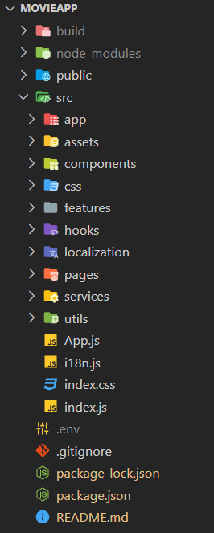
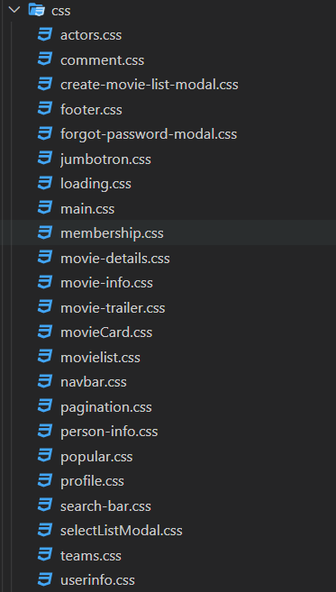

<h1 style="text-align:center;" id="mainHeader">React Movie App</h1>

Uygulamaya gitmek için <a href="https://halilcancengiz.github.io/react-movie-app/" target="blank">tıklayın.</a>

<h3 style="text-align:center;text-transform:capitalize">--Kullanılan teknolojiler ve Kütüphaneler--</h3>
<ul style="display:flex;flex-wrap:wrap;justify-content:center">
<li style="list-style-type:none;display:flex;align-items:center;margin-top:10px;">

Javascript
</li>
<li style="list-style-type:none;display:flex;align-items:center;margin-top:10px;">

ReactJS
</li>
<li style="list-style-type:none;display:flex;align-items:center;margin-top:10px;">

Firebase
</li>
<li style="list-style-type:none;display:flex;align-items:center;margin-top:10px;">

Bootstrap
</li>
<li style="list-style-type:none;display:flex;align-items:center;margin-top:10px;">

Ant Design
</li>
<li style="list-style-type:none;display:flex;align-items:center;margin-top:10px;">

React Hot Toast
</li>
<li style="list-style-type:none;display:flex;align-items:center;margin-top:10px;">

React Slick
</li>
<li style="list-style-type:none;display:flex;align-items:center;margin-top:10px;">

React Router
</li>
<li style="list-style-type:none;display:flex;align-items:center;margin-top:10px;">

i18next
</li>
</ul>
<h3 style="text-align:center;text-transform:capitalize;margin:10px">--Dosya Yapısı--</h3>

<h3 style="text-align:center;text-transform:capitalize;margin:10px">--uygulama özellikleri--</h3>
<ul style="list-style-type:none;">
<li style="text-align:flex-start;">Kendinize ait hesap oluşturabilirsiniz. İsminizi ve fotoğrafınızı güncelleyebilirsiniz. Yaptığınız yorumların, eklediğiniz filmlerin ve oluşturduğunuz listelerin istatistiklerine profil sayfasından erişebilirsiniz.</li>
<li style="text-align:flex-start;">Popüler filmlere ve en çok oylanan filmlere tek tıkla ulaşabilirsiniz. Bunun haricinde istediğiniz bir filmi aratabilir, filmin detay sayfasına giderek film hakkında bilgi alabilirsiniz. Filmde yer alan oyuncuların ve ekip üyelerinin rol aldığı diğer filmlere göz atabilirsiniz. Oyuncuların ve filmin imdb linkine tıklayarak imdb adresine gidebilirsiniz. Ana sayfada güncel filmleri kontrol edebilir ve türlere göre arama yapabilirsiniz.</li>
<li style="text-align:flex-start;">Üyelik girişi yaptıysanız filmlere yorum yapabilir, yorumlanızı düzenleyebilir veya yorumunuzu silebilirsiniz.</li>
<li style="text-align:flex-start;">Kendinize ait film listesi oluşturabilirsiniz. Örk : izlenecekler,dram filmleri,savaş filmleri veya izlediğim filmler gibi tamamen size kalmış. Filmleri listeden silebilir, oluşturduğunuz listeleri silebilirsiniz. Şu anlık için liste ismi güncelleme özelliği bulunmamaktadır. </li>
<li style="text-align:flex-start;">Dil seçenekleri mevcuttur. Şu anlık için sadece Türkçe ve İngilizce mevcuttur.</li>
<li style="text-align:flex-start;">Uygulamam tamamen responsive olarak ayarlanmıştır. İsterseniz mobil cihazlarınızdan da erişim sağlayabilirsiniz.</li>

</ul>
<h3 style="text-align:center;text-transform:capitalize;margin:20px">--uygulama içi görüntüler--</h3>

    

    
    
    
    
    
    
    

